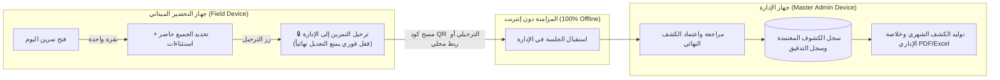
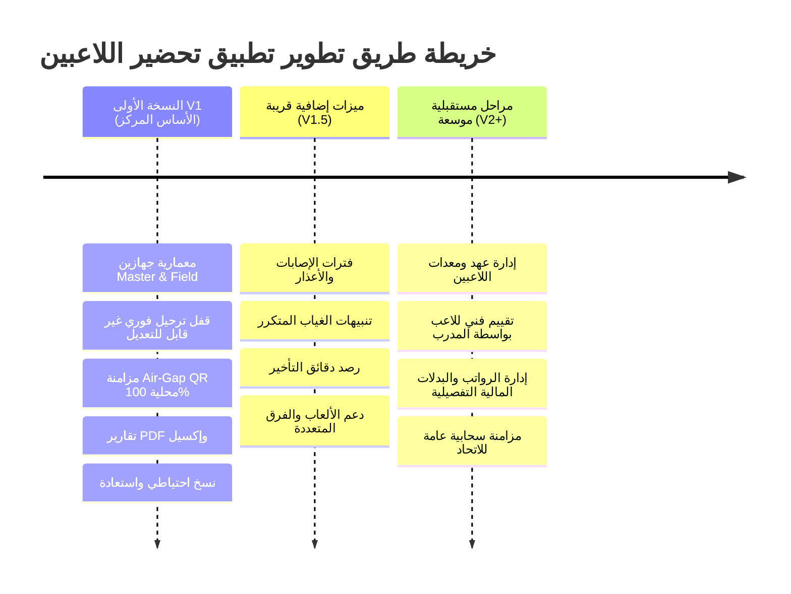

# وثيقة تصور مشروع: تطبيق تحضير اللاعبين والانضباط
**نادي تضامن حضرموت**  
**إعداد:** موناز (MONAZ)  
**التاريخ:** 6 أكتوبر 2026  
**الخصائص التشغيلية:** نظام ثنائي الأجهزة (Master & Field) | يعمل بدون إنترنت 100% (Offline-First) | واجهة عربية متكاملة (RTL) | مزامنة محلية وقفل ترحيل صارم  

---

## 1. الفكرة العامة وفلسفة المشروع (Executive Summary)

تطبيق داخلي مستقل يعمل دون الحاجة لأي اتصال بالإنترنت، صُمم خصيصاً لمساعدة إداريي نادي تضامن حضرموت على تسجيل ومتابعة حضور وغياب اللاعبين في التمارين والمباريات والأنشطة المختلفة بشكل لحظي وسريع. 

يقوم التطبيق بأتمتة استخراج **الكشف الشهري** و**خلاصة الإداري** تلقائياً بدقة تامة، مع حفظ جميع البيانات محلياً على الجهاز نفسه، وإتاحة خيارات المراجعة والاعتماد والتصدير والطباعة دون أي تبعية لشبكة الإنترنت أو خوادم سحابية.

### المبادئ الحاكمة للتصميم:
* **السرعة الميدانية الفائقة:** إنهاء التحضير اليومي في ثوانٍ معدودة لتفادي إشغال الإداري عن مهامه الميدانية.
* **عزل الإعدادات عن التشغيل:** واجهة التحضير اليومية بسيطة وخالية من أي تعقيد، بينما تُعزل الإعدادات المتقدمة في قسم مخصص ومحمي.
* **الأمان وصحة البيانات:** منع أي تداخل بين أيام الراحة والغياب، وضمان عدم اعتماد أي كشف به نواقص دون تأكيد صريح.

---

## 2. المشكلة المعالجة والحل الرقمي (Problem vs. Solution)

| الوضع الحالي (العمل الورقي) | الحل المقترح (تطبيق التحضير والانضباط) |
| :--- | :--- |
| الاعتماد على كشوف ورقية عرضة للتلف، الضياع، وصعوبة القراءة. | سجل رقمي محلي محفوظ ومحمي، مع إمكانية النسخ الاحتياطي الخارجي. |
| استهلاك وقت وجهد كبيرين في التجميع اليدوي لأيام الحضور والغياب نهاية كل شهر. | توليد آلي فوري للكشوف الشهرية وخلاصة الإداري بنقرة زر واحدة وبدقة رياضية تامة. |
| كثرة الأخطاء البشرية في التفريق بين الغياب بعذر، الغياب بدون عذر، والراحة. | قواعد حسابية برمجية صارمة تميز تلقائياً بين أيام الراحة، الأعذار، والاستحقاق. |
| صعوبة معرفة التاريخ الانضباطي للاعب وتتبع تكرار الغياب طوال الموسم. | ملف رقمي شامل لكل لاعب يوضح تاريخه، نسب التزامه، وتنبيهات فورية عند تكرار الغياب. |

---

## 3. الأساس المعتمد والمطابقة مع نماذج النادي (Source Forms)

بُني هذا التصور ليحاكي رقمياً ويطور النموذجين المعتمدين رسمياً في نادي تضامن حضرموت:
1. **«حافظة التحضير مفتوحة»:**
   * السجل الشهري الميداني الذي يعرض مصفوفة بأسماء اللاعبين وأيام الشهر وحالات الحضور والغياب اليومية.
2. **«كشف التحضير مع خلاصة الإداري»:**
   * الكشف النهائي الذي يجمع إجمالي: (الحضور، الغياب بعذر، الغياب بدون عذر، إجمالي التمارين، أيام/حصص الاستحقاق، أسباب الغياب، الملاحظات الإدارية، وخانات التوقيع الرسمية).

> **ملاحظة:** يمكن إدخال قائمة اللاعبين الحالية للنادي مباشرة إلى قاعدة بيانات التطبيق بعد تنقيح ومراجعة أسمائهم الرسمية.

---

## 4. حدود ونطاق النسخة الأولى (V1 Scope Boundaries)

* **الحزمة التقنية المعتمدة للتشغيل المنفصل 100%:**
  * **تطبيق النادي الميداني:** `Flutter (v3.47.5 - النسخة المثبتة بالجهاز)` مع `Dart (v3.13.4)` و `flutter_bloc` و `SQLite (Drift)`، يعمل بدون إنترنت نهائياً (100% Offline) على أجهزة التابلت أندرويد وكمبيوترات ويندوز مع دعم كامل لـ Material 3.
  * **لوحة تحكم المزود موناز:** `Laravel (v12.x)` مع `PHP (v8.2+)` و `Filament (v3.x)` و `PostgreSQL` لإصدار أكواد التفعيل المشفرة بالباقات وإدارة الأندية.
* **الحفاظ التام على البيانات عند التحديث:** عزل مخزن البيانات عن ملفات البرنامج؛ وتطبيق الترقية التلقائية لقاعدة البيانات (Schema Migrations) لضمان عدم ضياع أي سجلات أو لاعبين سابقين عند تحديث التطبيق.
* **استبعاد كامل لأي جانب مالي في V1:** لا توجد أي مبالغ نقدية أو بدلات مالية؛ ومفهوم "الاستحقاق" رياضي وانضباطي بحت (عدد الأيام أو الحصص المؤهلة للمشاركة أو التقييم فقط).
* **نظام الترخيص والتفعيل بالباقات محلياً:** قفل وتفعيل الجهازين برمز مشفر يربط معرفي العتاد باسم النادي وباقة محددة المدة، مع حماية التلاعب بالوقت ودون حاجة للإنترنت.
* **لا حسابات للاعبين:** التطبيق مخصص للإداريين فقط، ولا يتطلب من اللاعبين امتلاك أجهزة أو حسابات أو تسجيل دخول.
* **معمارية الجهازين والمزامنة المحلية دون إنترنت (Master-Field Architecture):**
  * توزيع الأدوار بين جهازين: **جهاز الإدارة والاعتماد (Master Admin)** بكامل الصلاحيات، و**جهاز التحضير الميداني (Field Attendance)** للملعب فقط.
  * **القفل الصارم بعد الترحيل:** بمجرد نقر «ترحيل التمرين إلى الإدارة» في جهاز الميدان، يُقفل التمرين فوراً وتُعطل كافة أزرار التعديل والحفظ لمنع العبث.
  * **مزامنة محلية 100% دون إنترنت:** تتم المزامنة بين الجهازين عبر مسح كود QR الترحيلي في ثانيتين، أو عبر الاتصال اللاسلكي المباشر Local Wi-Fi/Hotspot دون أي خوادم سحابية.
* **دعم الفئات والفرق:** يتيح النظام إدارة عدة فرق أو فئات عمرية (أول، شباب، ناشئين) مع عزل بيانات كل فريق.

---

## 5. رحلة الاستخدام اليومي وتفاصيل الشاشات (Daily Workflow & Screens)

تدور دورة العمل اليومية حول مسار محكم وموزع بين الجهازين: **[فتح تمرين اليوم في جهاز الميدان] ← [تحضير بلمسة واحدة] ← [ترحيل وقفل فوري للتعديل] ← [مزامنة محلية دون نت] ← [اعتماد وتصدير في جهاز الإدارة]**.

### تفاصيل الشاشات:

### 1. الشاشة الرئيسية (Home Dashboard)
* تعرض تاريخ اليوم الهجري والميلادي، الفريق النشط المختار، وحصة التمرين المجدولة لليوم.
* زر رئيسي واضح وكبير: **«بدء التحضير»**.
* عدادات بصرية سريعة: عدد الحاضرين، الغائبين، والسجلات غير المكتملة.
* إمكانية إضافة تمرين طارئ/استثنائي أو اختيار حصة سابقة لم يكتمل تحضيرها.

### 2. شاشة التحضير الميداني (Attendance Taking)
* قائمة بأسماء اللاعبين مرتبة أبجدياً أو حسب الأرقام، مع شريط بحث سريع وفوري.
* خيارات رصد واضحة ومتباينة الألوان لكل لاعب:
  * **حاضر** (أخضر).
  * **غائب بعذر** (أصفر/برتقالي).
  * **غائب بدون عذر** (أحمر).
  * خيارات مفعلة اختيارياً من الإعدادات: (متأخر مع مدة التأخير، مصاب، استثناء).
* **زر التسريع الذكي («تحديد الجميع حاضر»):** يُمكّن الإداري بنقرة واحدة من وضع جميع اللاعبين كـ "حاضر"، ثم يقوم فقط بتغيير حالة اللاعبين الغائبين أو المستثنين، مما يختصر وقت التحضير إلى أقل من 30 ثانية.

### 3. شاشة مراجعة واعتماد الكشف (Review & Finalization)
* تظهر عند الضغط على "إنهاء التحضير".
* تعرض ملخصاً إجمالياً بالأعداد والنسب المئوية.
* تسليط الضوء على أي لاعب لم يتم تسجيل حالته (تظهر بلون تنبيهي).
* **حفظ تلقائي كمسودة:** تُحفظ المدخلات تلقائياً حتى لا تضيع البيانات عند انقطاع التطبيق أو إغلاقه.
* **منع الاعتماد الناقص:** يُمنع اعتماد الكشف ككشف نهائي إلا بعد استكمال رصد كافة اللاعبين (اللاعب غير المسجل لا يُعتبر غائباً بشكل تلقائي لتفادي خطأ السهو).

### 4. إدارة اللاعبين (Players Directory)
* قائمة تفاعلية لإدارة اللاعبين (إضافة، تعديل، أرشفة، انتقال بين الفرق).
* **البيانات الأساسية الإلزامية:** الاسم الكامل، الفريق/الفئة، تاريخ الانضمام للنادي.
* **البيانات الاختيارية:** الصورة الشخصية، رقم القميص، المركز/الموقع، بيانات التواصل وأولياء الأمور.
* ملف تفصيلي لكل لاعب يوضح سجله التاريخي الكامل ونسب حضوره.

### 5. السجل والتقارير (Records & Reports)
* أرشيف متكامل للكشوف اليومية، الكشوف الشهرية المعتمدة، وسجل اللاعبين.
* فلاتر متقدمة حسب الفريق، الموسم، والشهر.
* إمكانية مراجعة أي كشف سابق مع إمكانية التعديل المشروط (يجب تسجيل سبب التعديل وهوية المعدّل في سجل التدقيق).

### 6. الإعدادات والتهيئة (Settings)
* تشتمل على إعدادات هوية النادي، الفرق، جداول التمارين، حالات التحضير، قواعد الاستحقاق، والنسخ الاحتياطي.
* **مبدأ العزل:** تم عزل هذه الشاشة برمز حماية (PIN) واختيار وضعين على الجهاز (وضع الإداري للتحضير فقط / وضع المالك للإعدادات).

---

## 6. الإعدادات القابلة للتخصيص (Dynamic Configuration Engine)

صُمم النظام ليكون مرناً بالكامل بحيث يضبط المسؤول القواعد دون الحاجة لأي تعديل برمجي:

1. **النادي والموسم والفرق:**
   * تعديل اسم النادي، الشعار، مسمى الموسم الرياضي، وأسماء الإداري ورئيس النادي/المدير للاعتماد والتوقيعات.
   * إنشاء عدة فرق وفئات رياضية (فريق أول، شباب، ناشئين، ألعاب قوى...) وربط اللاعبين بها.
   * إدارة انتقالات اللاعبين بين الفئات وأرشفتهم مع الحفاظ على سجلاتهم السابقة.
2. **التمارين والأنشطة:**
   * تحديد الأيام المعتمدة أسبوعياً وأوقاتها وملاعبها لكل فريق على حدة.
   * إمكانية إضافة أكثر من حصة تدريبية في اليوم الواحد (صباحية / مسائية).
   * إدراج مباريات، اجتماعات، أو أنشطة ثقافية، مع إمكانية إلغاء أو تأجيل التمارين وتحديد أثر الإلغاء.
3. **حالات التحضير وأسباب الغياب:**
   * إضافة حالات جديدة، تسميتها، واختيار لونها ورمزها.
   * تصنيف الحالة أوتوماتيكياً: (حضور / غياب بعذر / غياب بدون عذر / استثناء).
   * تحديد أثر كل حالة على الانضباط وأيام الاستحقاق.
   * تجهيز قائمة أسباب غياب شائعة منسدلة مع حقل مفتوح لكتابة الملاحظات اليدوية.
4. **الانضباط والاستحقاق:**
   * تفعيل رصد التأخير بالدقائق وتحديد حدوده (مثال: تأخير أكثر من 15 دقيقة = نصف حضور أو ملاحظة).
   * تنبيهات تكرار الغياب (مثال: تنبيه عند غياب اللاعب 3 حصص متتالية).
   * تشغيل أو إيقاف نظام "الاستحقاق" واختيار وحدة الحساب (أيام أو حصص رياضية بحتة).
   * (ملاحظة: البدلات المالية مؤجلة للمراحل المستقبلية V2+، والاستحقاق في V1 رياضي وانضباطي فقط).
5. **التقارير والحقول الإضافية:**
   * التحكم بالأعمدة المرئية في الكشوف والطباعة.
   * إضافة حقول إضافية لبطاقة اللاعب (مثل: مقاس الزي، فصيلة الدم، ملاحظة إدارية خاصة).
6. **الحماية والأمان:**
   * قفل التطبيق أو شاشة الإعدادات برمز مرور (PIN).
   * تذكيرات تلقائية بعمل نسخ احتياطي دوري للبيانات.

---

## 7. قواعد الحساب وصحة السجل (Calculation Rules & Data Integrity)

وضعت الوثيقة منطقاً حسابياً دقيقاً يمنع الأخطاء الشائعة والخلط الإداري:

* **ما الذي يدخل في الحساب؟**
  * تُحسب فقط الأنشطة الرسمية المعتمدة التي حُددت بأنها "تدخل في التحضير".
  * **أيام الراحة الرسمية** و**التمارين الملغاة** لا تُحتسب مطلقاً ضمن إجمالي التمارين، ولا يُسجل بسببها أي غياب على أي لاعب.
  * لكل لاعب سجل واحد فقط في كل حصة تدريبية.
* **دورة حياة اللاعب (Player Lifecycle):**
  * تبدأ متابعة حضور وغياب اللاعب حصراً من **تاريخ انضمامه الرسمي** للفريق.
  * الأيام والحصص التي سبقت تاريخ انضمامه تُعتبر خارج حسابه ولا تُحتسب عليه كغياب.
  * عند نقل اللاعب لفريق آخر أو أرشفته، تُقفل متابعته من تاريخ الخروج دون المساس بسجلاته القديمة أو حذفها.
* **إدارة الأعذار والإصابات طويلة المدى:**
  * يتيح النظام تسجيل إجازة أو عذر مرضي أو إصابة بفترة زمنية محددة (من تاريخ ... إلى تاريخ ...) مع المبرر.
  * خلال هذه الفترة، يقترح النظام تلقائياً حالة "معذور/مصاب" في الحصص اليومية، ولكن يظل اعتمادها خاضعاً لمراجعة الإداري.
* **مفهوم "أيام الاستحقاق" (Entitlement Days):**
  * يُميز النظام بوضوح بين **أيام الحضور الفعلي** و**أيام الاستحقاق**.
  * أيام الاستحقاق هي الأيام أو الحصص المؤهلة وفق سياسة إدارة النادي للمكافأة أو التقييم.
  * **مثال عملي:**
    * لاعب حضر 20 يوماً، وغاب يومين بعذر مقبول:
      * إذا كانت سياسة النادي تحتسب العذر: يُسجل استحقاقه = **22 يوماً**.
      * إذا كانت سياسة النادي لا تحتسب العذر: يُسجل استحقاقه = **20 يوماً**.
    * الغياب بدون عذر يخصم أو يُعامل وفق قواعد النادي.
* **سجل التدقيق والتاريخ (Audit Trail):**
  * عند الحاجة لتعديل كشف معتمد، يُلزم النظام المستخدم بكتابة **سبب التعديل**، ويُحفظ وقت التعديل وهوية المستخدم برمجياً في سجل التغييرات.
  * تغيير قواعد الحساب يسري مستقبلاً من التاريخ المحدد دون التأثير على كشوف الأشهر السابقة، ما لم يطلب المسؤول صراحة "إعادة احتساب".

---

## 8. التقارير، التصدير، والطباعة (Reports & Export)

صُممت المخرجات لتطابق متطلبات التوثيق الرياضي العربي:

### 1. كشف التحضير الشهري («حافظة التحضير مفتوحة»)
* مصفوفة بيانية (Matrix Table) بالأسماء والتواريخ من اليمين إلى اليسار (RTL).
* تدرج رموز الحالات ومفتاح واضح يفسر كل رمز أسفل الكشف.
* تقسيم احترافي عند تعدد الصفحات مع الاحتفاظ بترويسة النادي (الاسم، الشعار، الشهر، الفئة) وخانات التوقيع الرسمية (الإداري، مدير النادي).

### 2. خلاصة الإداري
* جدول تحليلي تجميعي يوضح لكل لاعب:
  * عدد أيام الحضور.
  * الغياب بعذر، الغياب بدون عذر.
  * إجمالي التمارين المقامة والتي يدخل اللاعب في حسابها.
  * إجمالي أيام/حصص الاستحقاق (عند تفعيلها).
  * خانات مخصصة لأسباب الغياب والملاحظات الإدارية.
  * خانة منفصلة لإجمالي دقائق التأخير إن وُجدت.

### 3. تقرير اللاعب والفريق
* تقرير فردي تفصيلي لمسيرة اللاعب خلال فترة زمنية محددة.
* ملخص الفريق، متضمناً مؤشرات الغياب المتكرر ونسبة الالتزام المحسوبة بالمعادلة:
$$\text{نسبة الحضور} = \left( \frac{\text{الحصص المسجلة كحضور}}{\text{الحصص المؤهلة للاعب}} \right) \times 100\%$$

### 4. آليات التصدير والطباعة (Offline Export)
* **تصدير PDF:** تصميم عالي الجودة يدعم اللغة العربية بشكل مثالي (RTL) وجاهز للطباعة المباشرة والمشاركة عبر واتساب عند توفر اتصال.
* **تصدير Excel / CSV:** جدول بيانات مرتب ومجهز للفتح في برامج الجداول الإلكترونية لاستخدامه في الشؤون الإدارية أو المالية.
* تتم عمليات التصدير بالكامل داخلياً على الجهاز بدون إنترنت.

---

## 9. إدارة البيانات والنسخ الاحتياطي المحلي (Local Storage & Backup)

نظراً لعمل النظام محلياً بين جهازي الإدارة والميدان دون خادم سحابي، وُضعت تدابير حماية قوية:

* **التخزين المحلي الآمن:** تُحفظ جميع البيانات محلياً في قاعدة بيانات سريعة ومحمية على ذاكرة الجهازين.
* **النسخ الاحتياطي الكامل (Database Backup):**
  * إمكانية تصدير ملف نسخة احتياطية كاملة (يشمل قاعدة البيانات، الإعدادات، وسجلات التعديل) إلى مجلد خارجي يختاره المستخدم أو إلى ذاكرة تخزين خارجية (فلاش ميموري / USB / بطاقة SD) من جهاز الإدارة.
  * التنبيه الدوري للإداري لعمل نسخة خارجية تجنباً لمخاطر تلف الجهاز أو فقدانه.
* **استعادة البيانات (Database Restore):**
  * إمكانية استعادة البيانات على أي جهاز جديد يعمل عليه التطبيق.
  * عرض معلومات وتاريخ النسخة الاحتياطية قبل الاستعادة مع تحذير أمني صارم يطلب تأكيد الكتابة فوق البيانات القديمة.
* **التوضيح الأمني:** ملفات التقرير المخرجة (PDF أو Excel) تُستخدم للقراءة والطباعة فقط وليست بديلاً عن ملف النسخة الاحتياطية لقاعدة البيانات.

---

## 10. خطة التوسع والمراحل (Roadmap & Phases)

### 1. النسخة الأولى V1 (الأساس المركز):
* التشغيل المحلي المنفصل بنظام الجهازين (جهاز الإدارة الكامل Master Admin + جهاز التحضير الميداني Field Attendance) دون إنترنت.
* شاشة تحضير فائقة السرعة مع زر «تحديد الجميع حاضر» (أقل من 30 ثانية).
* **قفل الترحيل الفوري والصارم:** تحويل التمرين لوضع القراءة فقط بمجرد الترحيل ومنع أي تعديل لاحق على جهاز الميدان.
* **محرك المزامنة المحلي دون إنترنت 100%:** عبر مسح كود QR الترحيلي في ثانيتين (Air-Gap) أو الربط اللاسلكي المباشر Local Wi-Fi/Hotspot.
* الحفظ التلقائي كمسودات، واشتراط اكتمال الرصد قبل الترحيل أو الاعتماد.
* سجل تدقيق التعديلات الاستثنائية المعتمدة (Audit Trail) على جهاز الإدارة.
* تصدير نموذجي النادي: كشف التحضير وخلاصة الإداري (PDF + Excel) من جهاز الإدارة.
* النسخ الاحتياطي والاستعادة محلياً.

### 2. إضافات اختيارية سريعة ومفيدة:
* إدارة فترات الأعذار والإصابات المقترحة تلقائياً.
* تنبيهات محلية فورية للتمارين ولتكرار الغياب.
* ملخص شهري لنسب الحضور والانضباط.
* دعم متعدد للفرق والألعاب الرياضية مع إمكانية إخفاء الاختيار إذا كان النادي يستخدم فريقاً واحداً.

### 3. إضافات لمرحلة لاحقة (خارج نطاق V1):
* إدارة العهد والمعدات والملابس المسلمة للاعبين.
* التقييم الفني والبدني الميداني للمدرب.
* كشوفات مالية متقدمة ومسيرات رواتب وبدلات تفصيلية.
* المزامنة السحابية العامة عبر الإنترنت أو لوحة تحكم سحابية لفرع اتحاد كرة القدم.

---

## 11. التوصيات وقائمة القرارات قبل بدء التنفيذ (Action Items)

لضمان نجاح التنفيذ وسلاسة الاستخدام الميداني، يُوصى بحسم النقاط التالية:

1. **بيئة ونوع الجهاز المعتمدة (Platform & Hardware):**
   * تم اعتماد وتشغيل النظام عبر Flutter 3.47.5 لنظامي أندرويد (أجهزة لوحية/هواتف ميدانية) وويندوز (أجهزة الحواسيب الإدارية) مع قاعدة بيانات Drift SQLite محلية 100%.
2. **اعتماد صيغة "الاستحقاق الرياضي والانضباطي":**
   * احتساب أيام وحصص الاستحقاق الرياضي للمشاركة الرياضية فقط، مع الاستبعاد التام والنهائي لأي مكافآت أو تعاملات نقدية في المرحلة الأولى (V1).
3. **حسم قاعدة تعدد الحصص في اليوم الواحد:**
   * في حال أقيم تمرينان في يوم واحد (صباحي ومسائي)، كيف يُحسب ذلك في مجموع الأيام الشهري والاستحقاق؟
4. **تجهيز قائمة أسماء اللاعبين:**
   * استلام الكشف الورقي أو جدول إكسيل الحالي لأسماء وبيانات اللاعبين لتجهيز ميزة الاستيراد الأولي بنقرة واحدة بدلاً من الإدخال اليدوي.
5. **اختبار تجربة المستخدم في "وضع الطيران" (Airplane Mode Test):**
   * تجربة شاشات التحضير مع الإداري الفعلي للتأكد من سهولة الخطوات وسرعتها القصوى، واختبار كافة السيناريوهات (تسجيل، إغلاق مفاجئ، إعادة فتح، تصدير، ونسخ احتياطي) دون أي اتصال بالشبكة.

---
*تم توثيق هذا التصور ليكون المرجع الهندسي والإداري الشامل لعملية تطوير وتطبيق النظام لنادي تضامن حضرموت.*
