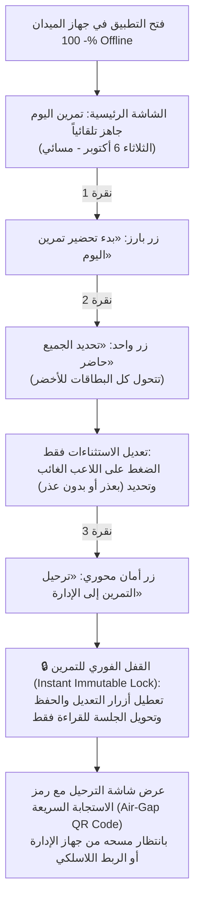

# خطة تنفيذ المرحلة الأولى (V1) - تطبيق تحضير اللاعبين والانضباط
**نادي تضامن حضرموت | موناز (MONAZ)**  
**الحالة:** وثيقة خطة العمل التنفيذية المعتمدة (معمارية الجهازين والتشغيل المنفصل 100% والمزامنة دون إنترنت)  
**نوع النظام:** نظام ثنائي الأجهزة (Master-Field Architecture) يعمل 100% Offline مع لوحة سحابية للمزود  

---

## 1. أهداف ونطاق المرحلة الأولى (V1 Scope & Architecture)

الهدف من هذه المرحلة هو إطلاق **نظام ميداني متكامل ومحكم** يمكّن نادي تضامن حضرموت من الاستغناء النهائي عن الكشوفات الورقية عبر توزيع المسؤوليات بين **جهازين ومستخدمين اثنين** داخل النادي:
1. **جهاز الإدارة والاعتماد (Master Admin Device):** جهاز بصلاحيات كاملة لإدارة النادي واللاعبين، الترخيص، استقبال التمارين المرحلة، الاعتماد النهائي، التعديل الاستثنائي مع سجل التدقيق، واستخراج الكشوفات والتقارير الرسمية (PDF/Excel).
2. **جهاز التحضير الميداني (Field Attendance Device):** جهاز مخصص للملعب في يد الإداري الميداني؛ مهمته الوحيدة تحضير تمرين اليوم بسرعة فائقة وترحيله للإدارة.
3. **القفل الصارم وغير القابل للتعديل بعد الترحيل (Immutable Lock upon Dispatch):** بمجرد نقر «ترحيل التمرين إلى الإدارة»، **يُقفل التمرين فوراً وتُعطل كافة أزرار التعديل والحفظ على جهاز الميدان**، ويصبح الكشف ثابتاً لا يمكن العبث به.
4. **المزامنة دون إنترنت 100% (Strict Offline Synchronization):** تتم مزامنة البيانات بين الجهازين محلياً بنسبة 100% دون الحاجة لأي اتصال بالإنترنت (عبر مسح كود QR الترحيلي فائق السرعة، أو عبر الاتصال اللاسلكي المحلي المباشر Local Wi-Fi / Hotspot).

---

## 2. مصفوفة الصلاحيات وتوزيع الأدوار بين الجهازين (Device & Role Matrix)

```
┌────────────────────────────────────────┐       مزامنة محلية 100% دون إنترنت       ┌────────────────────────────────────────┐
│     جهاز الإدارة (Master Admin)        │ <══════════════════════════════════════> │   جهاز الميدان (Field Attendance)      │
│  • إدارة الفرق واللاعبين والإعدادات    │   1. مسح QR الترحيل (Air-Gap QR Delta)    │  • فتح تمرين اليوم تلقائياً            │
│  • استقبال التمارين المرحّلة           │   2. ربط لاسلكي محلي (Local Wi-Fi/Hotspot)│  • «تحديد الجميع حاضر» ورصد الغياب     │
│  • الاعتماد النهائي وسجل التدقيق       │   3. ملف حزمة مشفرة (.tdsync)             │  • «ترحيل التمرين» ⬅️ قفل فوري للتعديل │
│  • تصدير PDF/Excel وحماية الـ PIN      │                                          │  • وضع القراءة فقط بعد الترحيل         │
└────────────────────────────────────────┘                                          └────────────────────────────────────────┘
```

| الوظيفة / الصلاحية | جهاز الإدارة والاعتماد (Master Admin) | جهاز التحضير الميداني (Field Attendance) | ملاحظات هندسية وأمنية |
| :--- | :---: | :---: | :--- |
| **إدارة اللاعبين (إضافة، تعديل، أرشفة)** | ✅ كامل الصلاحية | ❌ محظور تماماً | لضمان وحدة مصدر البيانات المرجعية (Master Data Integrity). |
| **إدارة إعدادات النادي والفرق** | ✅ كامل الصلاحية | ❌ محظور تماماً | محمي برمز PIN ولا تظهر شاشته في جهاز الميدان. |
| **بدء تمرين اليوم ورصد الحضور** | ✅ متاح (عند الطوارئ) | ✅ الوظيفة الأساسية للملعب | رصد سريع بلمسة واحدة في أقل من 30 ثانية. |
| **ترحيل التمرين وقفل التعديل** | — (هو جهة الاستقبال) | ✅ الزر المحوري بعد التحضير | **بمجرد الترحيل يُقفل التمرين محلياً وتُمنع أي تعديلات نهائياً.** |
| **استقبال التمارين المرحّلة** | ✅ استقبال وفك تشفير واعتماد | ❌ لا يستقبل تمارين | عبر مسح كاميرا QR أو الربط المحلي اللاسلكي. |
| **تعديل كشف بعد الترحيل** | ✅ متاح مع إجبار تسجيل السبب | ❌ ممنوع قطعياً | أي تعديل لاحق يتم حصراً من الإدارة ويُسجل في `audit_logs`. |
| **الاعتماد النهائي وإغلاق الشهر** | ✅ كامل الصلاحية | ❌ محظور تماماً | الاعتماد يثبت السجل في مصفوفة الحافظة الشهرية. |
| **تصدير كشف التحضير وخلاصة الإداري (PDF/Excel)** | ✅ كامل الصلاحية | ❌ محظور تماماً | حصر المستندات الرسمية المعتمدة في إدارة النادي. |
| **النسخ الاحتياطي الخارجي وإدارة الترخيص** | ✅ كامل الصلاحية | ❌ محظور (مرخص تابع) | عزل كامل للبيانات وتفادي التشتيت الميداني. |

---

## 3. التدفق الميداني الصارم وقفل الترحيل (Field Attendance Flow & Instant Lock)



### قواعد وضوابط القفل الميداني الصارم:
1. **الرصد السريع (أقل من 30 ثانية):** الحضور هو الأصل بلمسة واحدة (`تحديد الجميع حاضر`)، ولا يُعدل سوى المستثنى.
2. **الترحيل الحاسم (One-Way Dispatch):**
   * عند ضغط زر «ترحيل التمرين إلى الإدارة»، يسأل النظام تأكيداً صريحاً: *«سيتم قفل التمرين وترحيله، ولن تتمكن من تعديله بعد ذلك. هل ترغب في المتابعة؟»*.
   * بمجرد الموافقة، يُسجل في قاعدة بيانات SQLite محلياً:
     * `is_dispatched = 1`
     * `dispatched_at = CURRENT_TIMESTAMP`
     * `is_locked = 1`
     * `sync_status = 'dispatched'`
3. **انعدام الرجعة في الميدان:** تختفي فوراً أزرار التعديل وحفظ المسودة وتصبح بطاقات اللاعبين غير قابلة للنقر، وتظهر شارة زرقاء داكنة: **[مرحّل ومقفل إدارياً]**.
4. **توليد حزمة الترحيل المشفرة (Signed Dispatch Delta):** تتولد حزمة بيانات مضغوطة تتضمن: معرف التمرين UUID، التاريخ، الفئة، مصفوفة الغائبين بأعذارهم، وختم توقيع رقمي `HMAC-SHA256` يربط الحزمة بمعرف جهاز الميدان.

---

## 4. محرك المزامنة دون إنترنت 100% (The Offline Sync Engine)

لضمان عمل النظام في ملاعب المكلا وبارادم ومكاتب النادي دون أدنى حاجة لشبكة خارجية، تم تصميم محرك مزامنة هجين بثلاث قنوات نقل محلية:

```
┌─────────────────────────────────────────────────────────────────────────────────┐
│                    محرك المزامنة المحلي (Offline Sync Engine)                   │
├─────────────────────────────────────────────────────────────────────────────────┤
│                                                                                 │
│   [القناة 1 - الأساسية الفورية]  Air-Gap QR Code Dispatch (المسح الضوئي المباشر)   │
│   • لجلسات التمارين اليومية.                                                    │
│   • جهاز الميدان يعرض كود QR مضغوطاً وموقعاً للحزمة (< 350 حرفاً).             │
│   • جهاز الإدارة يمسح الكود بكاميرته ⬅️ استيراد واعتماد فوري في ثانيتين!        │
│                                                                                 │
│   [القناة 2 - التبادلية اللاسلكية] Local Wi-Fi Direct / Hotspot Sync             │
│   • لنقل قائمة اللاعبين المحدثة من الإدارة إلى الميدان، أو نقل عدة تمارين معاً. │
│   • اتصال الجهازين بنفس الشبكة المحلية (نقطة اتصال Hotspot دون باقة إنترنت).   │
│   • خادم محلي خفيف مدمج في تطبيق الإدارة (Local HTTP Server via shelf/io).      │
│   • مزامنة ثنائية بنقرة واحدة عبر كود اقتران آمن (Pairing Handshake).           │
│                                                                                 │
│   [القناة 3 - الاحتياطية للطوارئ] Encrypted Transfer File (.tdsync)             │
│   • تصدير حزمة ترحيل مشفرة عبر كابل USB أو Bluetooth أو بطاقة ذاكرة.          │
│                                                                                 │
└─────────────────────────────────────────────────────────────────────────────────┘
```

### أ. القناة الأولى (Air-Gap QR Code Dispatch - المسح الضوئي الميداني):
* **لماذا هي القناة المثالية للملاعب؟** تعمل بدون كابلات، بدون راوتر، وبدون إذن شبكة، ومقاومة لأي تشويش في بيئة الملاعب الإسمنتية.
* **بنية حزمة الترحيل (Dispatch Delta Payload):**
  نظراً لأن جميع اللاعبين حاضرون افتراضياً، لا يتم نقل قائمة 30 لاعباً بالكامل! بل يُنقل فقط:
  ```json
  {
    "v": 1,
    "uuid": "e9b2c8a1-4321-4f1b-a192-b8c19203a111",
    "team_id": "team_first_squad",
    "date": "2026-10-06",
    "period": "مسائي",
    "type": "تمرين",
    "pres_cnt": 26,
    "exc": [
      {"pid": "p_12", "st": "excused", "rid": 1},
      {"pid": "p_19", "st": "absent", "rid": null}
    ],
    "f_dev": "TD-FLD-8821",
    "ts": 1791280920,
    "sig": "d98f7e2a4b1c..."
  }
  ```
* **الحجم والسرعة:** الحزمة لا تتعدى 250 بايت، وتتحول إلى كود QR عالي الوضوح (`QR Error Correction Level M`) يقرأه جهاز الإدارة من مسافة متر في **أقل من ثانية واحدة**.
* **الاستيراد الفوري في الإدارة:** يمسح جهاز الإدارة الكود، يفك التشفير، يتحقق من التوقيع، ويدرج التمرين في قاعدة بيانات الإدارة بحالة: **«مستلم من الميدان - بانتظار الاعتماد الإداري»**.

### ب. القناة الثانية (Local Offline Wi-Fi Direct / Hotspot Sync):
* **تبادل البيانات المرجعية (Master Data Propagation):**
  * عندما تسجل الإدارة 5 لاعبين جدد أو تعدل أرقام قمصانهم، تفتح الإدارة شاشة «بث قائمة اللاعبين للجهاز الميداني».
  * يقوم جهاز الإدارة بفتح نقطة اتصال محمولة (أو يتصل الجهازان براوتر النادي دون إنترنت).
  * يشغل تطبيق الإدارة خادماً محلياً مصغراً ومشراً (`Local Secure HttpServer`).
  * يفتح جهاز الميدان «تحديث قائمة اللاعبين»، فيقترن بالجهاز المحلي ويسحب القوائم والصور المحدثة تلقائياً في ثوانٍ.
* **المزامنة الشاملة للتمارين:** تتيح أيضاً لجهاز الميدان ترحيل 10 تمارين متراكمة دفعة واحدة إن لم يتم مسحها يوماً بيوم.

### ج. معالجة التعارض وضمان عدم التكرار (Idempotency Invariant):
* كل جلسة تمرين تمتلك معرفاً فريداً ثابتاً: `session_uuid`.
* حتى لو قام جهاز الإدارة بمسح نفس كود الـ QR ثلاث مرات بالخطأ، فإن خوارزمية الإدراج تطبق مبدأ (`UPSERT / INSERT OR IGNORE`) اعتماداً على الـ UUID، مما يمنع نهائياً تكرار التمرين أو ازدواجية السجلات.

---

## 5. الحزمة التقنية المحدثة (Approved Tech Stack)

```
┌──────────────────────────────────────────────────────────────────────────┐
│             1. تطبيق النادي الميداني والإداري (Flutter Multi-Role)       │
│                                                                          │
│   • إطار العمل: Flutter (v3.47.5 - المثبتة بالجهاز) مع Dart (v3.13.4)    │
│   • نمط الأدوار المزدوجة: نفس التطبيق يعمل بنمط (Master) أو (Field)       │
│   • إدارة الحالة: flutter_bloc (v8.1.6+)                                 │
│   • قاعدة البيانات المدمجة: SQLite عبر Drift مع استراتيجية ترحيل آمنة   │
│   • محرك المزامنة دون إنترنت: QR Scanner/Generator محلي + Shelf/HttpServer│
│   • محرك التقارير: PDF عربي RTL مدمج مع خط Cairo + جداول Excel           │
│   • المنصات المستهدفة: أجهزة تابلت أندرويد + كمبيوترات ويندوز (Desktop) │
└────────────────────────────────────┬─────────────────────────────────────┘
                                     │
                                     │ (أكواد التفعيل الموقعة رقمياً بـ Ed25519)
                                     │ (معرف جهاز الإدارة + معرف جهاز الميدان)
                                     ▼
┌──────────────────────────────────────────────────────────────────────────┐
│              2. لوحة تحكم المزود المركزية MONAZ (Online Server)          │
│                                                                          │
│   • إطار العمل: Laravel (v12.x) مع PHP (v8.2+) ولوحة Filament (v3.x)     │
│   • قاعدة البيانات المركزية: PostgreSQL                                   │
│   • الوظيفة: إدارة اشتراكات الأندية، إصدار باقات الترخيص المزدوجة         │
│     (Master License + Paired Field License)، وتوليد المفاتيح المشفرة     │
```

### الهيكلة المعيارية والتسميات المعبرة للمشاريع (Expressive Project Scaffolding):

#### أ. مشروع تطبيق النادي الميداني والإداري: `tadamon_attendance_app/`
```
tadamon_attendance_app/
├── android/ & windows/
├── assets/
│   ├── fonts/cairo/                 (الخطوط العربية Cairo محلياً 100%)
│   └── images/                      (شعار نادي التضامن main logo.png)
├── lib/
│   ├── main.dart                    (نقطة الإقلاع وتحديد نمط الجهاز)
│   ├── core/                        (المكونات المشتركة الصارمة)
│   │   ├── database/                (Drift SQLite setup & Schema Migrations)
│   │   ├── security/                (Ed25519 verifier, HMAC-SHA256, High-Watermark)
│   │   ├── sync/                    (محرك المزامنة المحلي: QR Generator & Scanner)
│   │   ├── theme/                   (الأزرق التضامني #0E4B94، Cairo Font، Tokens)
│   │   └── widgets/                 (مكتبة الودجات المخصصة AppButton, AttendanceBadge...)
│   └── features/                    (الميزات بنمط Clean Architecture + MVVM)
│       ├── activation/              (domain / data / presentation - رخصة الجهاز)
│       ├── attendance/              (domain / data / presentation - التحضير السريع والترحيل)
│       ├── players/                 (domain / data / presentation - إدارة اللاعبين - للإدارة)
│       ├── reports/                 (domain / data / presentation - كشف الحافظة وخلاصة الإداري)
│       ├── sync/                    (domain / data / presentation - المزامنة بـ QR والربط المحلي)
│       └── settings/                (domain / data / presentation - إعدادات النادي والـ PIN)
└── test/                            (اختبارات آلية 100%: unit, bloc, migration, widgets)
```

#### ب. مشروع لوحة تحكم المزود وإدارة التراخيص: `monaz_license_portal/`
```
monaz_license_portal/
├── app/
│   ├── Actions/                     (Single-Action Classes: توليد التراخيص وحساب المدد)
│   ├── Services/                    (Ed25519SignerService, DeviceFingerprintService)
│   ├── Http/
│   │   ├── Controllers/             (Thin Controllers لا تتجاوز 5-10 أسطر)
│   │   └── Requests/                (FormRequests فقط للتحقق من الصلاحيات والمدخلات)
│   ├── Models/                      (Club, Device, LicensePackage, License)
│   └── Filament/                    (لوحة الإدارة لإصدار التراخيص المزدوجة للنادي)
└── tests/                           (Pest / PHPUnit: Unit Tests & Feature Tests)
```

## 6. نظام الترخيص المزدوج للنادي (Paired Dual-Device Licensing)

تتيح لوحة تحكم المزود (Laravel 12 / Filament) إصدار **باقة ترخيص موحدة لنادي تضامن حضرموت تغطي الجهازين معاً**:

```
┌─────────────────────────────────────────────────────────────────────────┐
│                      باقة اشتراك نادي تضامن حضرموت                      │
│            • اسم النادي: نادي تضامن حضرموت الرياضي                      │
│            • الفريق: الفريق الأول / الشباب                              │
│            • صلاحية الباقة: موسم رياضي كامل (أو باقة شهرية)             │
├────────────────────────────────────┬────────────────────────────────────┤
│    ترخيص 1: جهاز الإدارة الرئيسي    │    ترخيص 2: جهاز التحضير الميداني  │
│    نوع الرخصة: MASTER_ADMIN        │    نوع الرخصة: FIELD_ATTENDANCE    │
│    البصمة العتادية: TD-MST-8419     │    البصمة العتادية: TD-FLD-3302    │
│    رمز PIN الإداري: مفعل ومشفر     │    رمز PIN الإداري: غير مطلوب      │
│    صلاحية التقارير: نعم            │    صلاحية التقارير: لا (تحضير فقط) │
└────────────────────────────────────┴────────────────────────────────────┘
```

1. **التحقق المستقل في كلا الجهازين:** يمتلك كل جهاز المفتاح العام `Ed25519 Public Key` للتحقق من كود ترخيصه بشكل محلي ومنفصل 100%.
2. **قفل التلاعب بالساعة (High-Watermark):** مفعل بشكل مستقل في كلا الجهازين لضمان عدم تقديم أو تأخير التاريخ.
3. **مفتاح الاقتران المحلي (Local Pairing Secret):** يتضمن كود الترخيص مفتاح تشفير مشترك بين الجهازين لضمان أن جهاز الإدارة لا يستقبل التمارين إلا من جهاز الميدان التابع لنفس النادي حصراً.

---

## 7. هيكل قاعدة البيانات المحلية في SQLite / Drift (Hardened Schema)

### 1. جدول بيانات الترخيص ووضع الجهاز (`license_security_store`)
```sql
CREATE TABLE license_security_store (
    device_id TEXT PRIMARY KEY,
    device_mode TEXT NOT NULL, -- 'master_admin' | 'field_attendance'
    paired_device_id TEXT,     -- معرف الجهاز المقترن التابع للنادي
    license_key TEXT NOT NULL,
    club_name TEXT NOT NULL,
    team_name TEXT,
    package_type TEXT NOT NULL,
    activated_at TEXT NOT NULL,
    expires_at TEXT NOT NULL,
    high_watermark_timestamp TEXT NOT NULL,
    cumulative_runtime_minutes INTEGER DEFAULT 0,
    tamper_flag INTEGER DEFAULT 0,
    signature_proof TEXT NOT NULL
);
```

### 2. جدول إعدادات النادي (`club_settings`) - *محمي برمز PIN ومتاح للإدارة فقط*
```sql
CREATE TABLE club_settings (
    id INTEGER PRIMARY KEY CHECK (id = 1),
    club_name TEXT NOT NULL,
    logo_path TEXT,
    season TEXT NOT NULL,
    admin_name TEXT,
    manager_name TEXT,
    pin_code_hash TEXT, -- مجزأ بملح عشوائي Salted Hash
    entitlement_sport_enabled INTEGER DEFAULT 1,
    entitlement_counts_excused INTEGER DEFAULT 1
);
```

### 3. جدول الفرق والفئات (`teams`)
```sql
CREATE TABLE teams (
    id TEXT PRIMARY KEY,
    name TEXT NOT NULL,
    category TEXT NOT NULL,
    created_at TEXT NOT NULL,
    updated_at TEXT NOT NULL
);
```

### 4. جدول اللاعبين (`players`)
```sql
CREATE TABLE players (
    id TEXT PRIMARY KEY,
    name TEXT NOT NULL,
    team_id TEXT NOT NULL REFERENCES teams(id),
    jersey_number INTEGER,
    position TEXT,
    join_date TEXT NOT NULL,
    is_archived INTEGER DEFAULT 0,
    notes TEXT,
    updated_at TEXT NOT NULL
);
```

### 5. جدول الحصص والتمارين وقفل الترحيل (`sessions`)
```sql
CREATE TABLE sessions (
    id TEXT PRIMARY KEY,               -- UUID فريد عالمياً (session_uuid)
    team_id TEXT NOT NULL REFERENCES teams(id),
    date TEXT NOT NULL,
    type TEXT NOT NULL DEFAULT 'تمرين',
    period TEXT NOT NULL DEFAULT 'مسائي',
    location TEXT,
    is_cancelled INTEGER DEFAULT 0,
    counts_in_attendance INTEGER DEFAULT 1,
    -- أعمدة معمارية الترحيل والمزامنة الجديدة:
    is_dispatched INTEGER DEFAULT 0,    -- 1 = تم ترحيله من جهاز الميدان
    dispatched_at TEXT,                 -- طابع وقت الترحيل
    is_locked INTEGER DEFAULT 0,        -- 1 = مقفل نهائياً يمنع تعديله
    sync_status TEXT NOT NULL DEFAULT 'local', -- 'local' | 'dispatched' | 'received' | 'approved'
    session_hash TEXT NOT NULL,         -- هاش للتحقق من سلامة البيانات
    status TEXT NOT NULL DEFAULT 'draft', -- 'draft' | 'pending_approval' | 'approved'
    approved_at TEXT,
    approved_by TEXT
);
```

### 6. جدول سجلات التحضير (`attendance_records`)
```sql
CREATE TABLE attendance_records (
    id TEXT PRIMARY KEY,
    session_id TEXT NOT NULL REFERENCES sessions(id) ON DELETE CASCADE,
    player_id TEXT NOT NULL REFERENCES players(id),
    status TEXT NOT NULL, -- present | excused | unexcused | late | exempt
    late_minutes INTEGER DEFAULT 0,
    reason TEXT,
    notes TEXT
);
```

### 7. جدول سجل التدقيق والتعديلات الإدارية (`audit_logs`)
```sql
CREATE TABLE audit_logs (
    id TEXT PRIMARY KEY,
    session_id TEXT NOT NULL REFERENCES sessions(id),
    action TEXT NOT NULL, -- 'dispatched' | 'received' | 'approved' | 'admin_override'
    modified_by TEXT NOT NULL,
    reason TEXT NOT NULL, -- إلزامية كتابة سبب التعديل الاستثنائي
    timestamp TEXT NOT NULL,
    diff TEXT NOT NULL
);
```

### 8. جدول سجل المزامنة وتدقيق الترحيل (`sync_audit_logs`)
```sql
CREATE TABLE sync_audit_logs (
    id TEXT PRIMARY KEY,
    session_id TEXT NOT NULL,
    sync_direction TEXT NOT NULL, -- 'field_to_master' | 'master_to_field'
    sync_channel TEXT NOT NULL,   -- 'qr_air_gap' | 'local_wifi' | 'file'
    source_device_id TEXT NOT NULL,
    target_device_id TEXT NOT NULL,
    synced_at TEXT NOT NULL,
    status TEXT NOT NULL          -- 'success' | 'rejected_tampered'
);
```

---

## 8. قواعد الحساب الرياضية الدقيقة في V1 (Pure Sports & Discipline Logic)

*جميع العمليات رياضية وانضباطية بحتة دون أي مبالغ نقدية أو بدلات:*
1. **معادلة إجمالي التمارين المؤهلة:**
   $$\text{إجمالي التمارين} = \sum (\text{الحصص المعتمدة من الإدارة والتي يدخل نوعها في التحضير وليست ملغاة})$$
2. **معادلة استحقاق اللاعب:**
   $$\text{أيام الاستحقاق الرياضي} = \text{الحضور} + (\text{الغياب بعذر إذا كان خيار العذر مفعلاً})$$
3. **معادلة نسبة الانضباط:**
   $$\text{نسبة الانضباط} = \left( \frac{\text{أيام الاستحقاق}}{\text{إجمالي التمارين المؤهلة للاعب}} \right) \times 100\%$$

---

## 9. خطة مراحل التنفيذ البرمجي المحدثة (Development Milestones)

| المرحلة | المهمة الرئيسية | المخرجات التفصيلية |
| :---: | :--- | :--- |
| **M1** | **تأسيس بيئة Flutter + Drift ومحرك الترحيل والقفل** | • إنشاء مشروع Flutter بنمط Clean Architecture + MVVM via BLoC.<br>• بناء جداول SQLite المحدثة (أعمدة `is_dispatched`, `is_locked`, `session_uuid`).<br>• اختبار ترقية الجداول الآلية (Drift Migrations) لضمان عدم ضياع أي بيانات. |
| **M2** | **محرك الترخيص المزدوج ولوحة Laravel 12** | • لوحة تحكم المزود (Laravel 12 + Filament) لتوليد رخصتي `Master` و `Field` موقتين بـ Ed25519.<br>• شاشة التفعيل وتحديد نمط تشغيل الجهاز (جهاز إدارة أم جهاز ميداني) مع قفل High-Watermark. |
| **M3** | **إدارة النادي واللاعبين (خاص بجهاز الإدارة)** | • واجهات إدارة الفرق وبطاقات اللاعبين والبحث السريع.<br>• حماية إعدادات النادي برمز PIN مع استبعاد تام لأي حقول مالية.<br>• ميزة تصدير/بث قائمة اللاعبين المحدثة للجهاز الميداني. |
| **M4** | **واجهة التحضير الميداني والقفل الصارم (Field Mode)** | • واجهة التحضير السريع (تجهيز تمرين اليوم تلقائياً بضغطة واحدة).<br>• زر «تحديد الجميع حاضر» وتعديل الغائبين فقط في أقل من 30 ثانية.<br>• **زر «ترحيل التمرين إلى الإدارة» وقفل الشاشة والتعديل فورياً (Immutable Lock).** |
| **M5** | **محرك المزامنة دون إنترنت 100% (The Offline Sync Engine)** | • **توليد وقراءة QR Code الترحيلي (Air-Gap QR Dispatch) واستيراد الجلسة في ثانيتين.**<br>• محرك المزامنة اللاسلكية المحلية (Local Wi-Fi/Hotspot Direct Sync) لنقل القوائم والتمارين.<br>• التحقق من التوقيع الرقمي ومنع تكرار الجلسات (`Idempotency`). |
| **M6** | **المراجعة والاعتماد وسجل التدقيق في جهاز الإدارة** | • استقبال التمارين المرحّلة ومراجعتها واعتمادها نهائياً.<br>• ميزة التعديل الاستثنائي مع إلزامية تسجيل سبب التعديل في `audit_logs`.<br>• توليد كشف التحضير الشهري وخلاصة الإداري وطباعة PDF عربي و Excel محلياً. |
| **M7** | **النسخ الاحتياطي وحزمة الاختبارات الآلية الميدانية** | • تصدير واستيراد نسخة احتياطية مشفرة لقاعدة بيانات الإدارة عبر USB.<br>• اختبار محاكاة جلسة ميدانية كاملة في وضع الطيران (100% Offline): تحضير ⬅️ ترحيل وقفل ⬅️ مزامنة بـ QR ⬅️ اعتماد إداري ⬅️ تصدير PDF.<br>• تشغيل حزمة الاختبارات الآلية الشاملة (Unit, BLoC, Migration, Functional Tests) بنسبة نجاح 100%. |

---

## 10. معايير القبول والجاهزية للإطلاق (Acceptance Criteria)

* [ ] **فصل الأدوار الصارم:** جهاز الميدان لا يملك صلاحية تعديل بيانات اللاعبين أو تغيير إعدادات النادي أو استخراج التقارير الرسمية.
* [ ] **القفل الفوري بعد الترحيل:** بمجرد الضغط على «ترحيل التمرين إلى الإدارة» في جهاز الميدان، يُقفل التمرين تماماً وتُعطل كافة أزرار التعديل والحفظ ويتحول إلى وضع القراءة فقط.
* [ ] **المزامنة 100% دون إنترنت:** تتم مزامنة التمرين المرحل من جهاز الميدان إلى جهاز الإدارة عبر مسح كود QR في أقل من ثانيتين في وضع الطيران الكامل (Airplane Mode).
* [ ] **منع التكرار (Idempotency):** مسح كود الـ QR أكثر من مرة لا يؤدي إلى تكرار التمرين أو مضاعفة أيام الحضور.
* [ ] **السرعة الميدانية:** تحضير تمرين لفريق من 30 لاعباً وترحيله يتم في أقل من **30 ثانية**.
* [ ] **تحديثات آمنة دون فقدان بيانات:** عند تحديث التطبيق إلى إصدار أحدث، تبقى كافة بيانات اللاعبين والتمارين السابقة محفوظة 100% في SQLite (مثبت باختبارات ترحيل Drift).
* [ ] **حظر المالية تماماً:** خلو تام لكافة الشاشات والجداول وقواعد البيانات من أي مبالغ نقدية أو بدلات.
* [ ] **أمان الترخيص وساعة الجهاز:** رفض التفعيل على أي جهاز آخر، وقفل التطبيق فوراً عند محاولة التلاعب بساعة وتاريخ النظام.
* [ ] **دقة التقارير:** مطابقة ملف الـ PDF المولد لترويسة وتصميم «حافظة التحضير» و«كشف خلاصة الإداري» المعتمدين بنادي تضامن حضرموت.
* [ ] **حزمة الاختبارات الآلية:** اجتياز كافة اختبارات الوحدة، وتدفق الترحيل والقفل، والمزامنة الثنائية بنسبة نجاح 100% دون أي فشل.

---

## 11. المرجع التنفيذي الهندسي المعتمد (Authoritative Execution Blueprint)

تم تفصيل وتقسيم مراحل بناء هذه المرحلة على 7 مراحل برمجية دقيقة مع تفصيل العزل ثلاثي الطبقات وبوابات الفحص اليدوي والاختبارات الآلية في الوثيقة المستقلة:
👉 **[دليل ومراحل التنفيذ البرمجية المنهجية للمرحلة الأولى (V1)](file:///e:/the%20work/monaz/monaz%20services/Tadamon/MONAZ_Tadamon_Offline_Attendance_Concept_AR/PHASE_1_EXECUTION_STAGES_AR.md)**

---
*تم اعتماد معمارية الجهازين المتقدمة، وقفل الترحيل الفوري، ومحرك المزامنة دون إنترنت 100% كركائز أساسية للمرحلة الأولى.*
